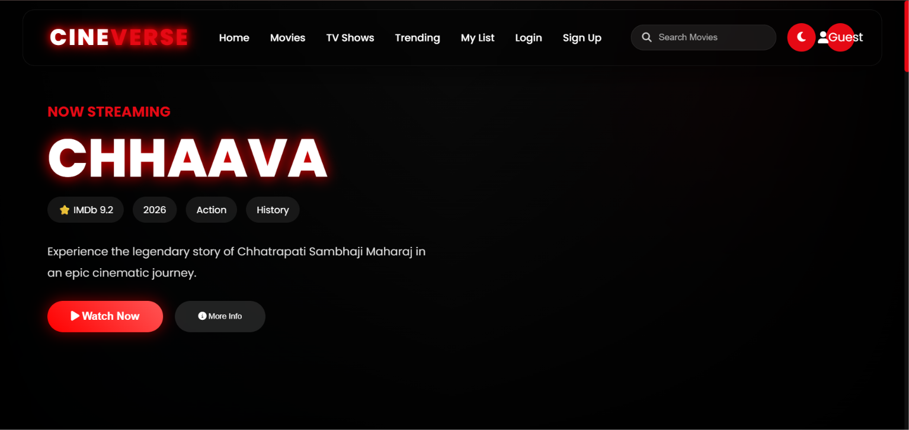
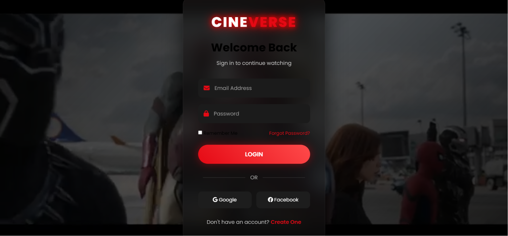
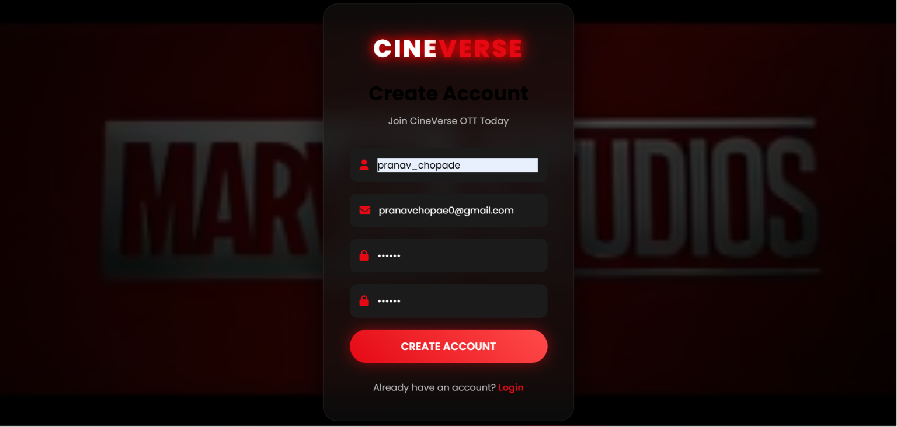

# 🎬 CineVerse - AWS OTT Movie Streaming Platform

A modern **OTT Movie Streaming Platform** built using **Amazon EC2, Amazon S3, AWS Lambda, Amazon API Gateway, Amazon DynamoDB, Amazon SNS, HTML, CSS, and JavaScript**. CineVerse allows users to browse movies, watch trailers, manage their watchlist, create user accounts, and stream content through a responsive cloud-hosted web application powered by AWS.

---

## 🚀 Live Demo

**Hosted on Amazon EC2**

``` 
http://15.207.54.226/login.html
```

---

# 📸 Screenshots

## Home Page



---

## Movie Library


---

## Movie Details


---

## Watch Trailer


---

## Login Page



---

## User Profile



---

# ✨ Features

- Browse Popular Movies
- Responsive Netflix-Style UI
- User Registration & Login
- Secure Authentication
- Movie Search
- Movie Categories
- Watch Movie Trailers
- My Watchlist
- User Profile Management
- Cloud-Based Media Storage
- REST APIs using API Gateway
- Responsive Design
- EC2 Hosted Frontend
- Serverless Backend
- CloudWatch Monitoring

---

# 🏗 Architecture

```
User Browser
      │
      ▼
Amazon EC2 (Apache Web Server)
      │
      ▼
Amazon API Gateway
      │
      ▼
AWS Lambda
      │
      ├──────────────► Amazon DynamoDB
      │                     │
      │                     ▼
      │            User & Movie Data
      │
      ├──────────────► Amazon S3
      │                     │
      │                     ▼
      │          Posters, Images & Videos
      │
      ▼
Amazon SNS (Notifications)
```

---

# ☁️ AWS Services Used

- Amazon EC2
- Amazon S3
- AWS Lambda
- Amazon API Gateway
- Amazon DynamoDB
- Amazon SNS
- AWS IAM
- Amazon CloudWatch

---

# 💻 Tech Stack

## Frontend

- HTML5
- CSS3
- JavaScript (Vanilla)

## Backend

- Python
- AWS Lambda

## Database

- Amazon DynamoDB

## Cloud

- Amazon EC2
- Amazon S3
- Amazon API Gateway
- Amazon DynamoDB
- Amazon SNS
- AWS IAM
- Amazon CloudWatch

---

# 📁 Project Structure

```
CineVerse-OTT-Platform
│
├── frontend
│   ├── index.html
│   ├── login.html
│   ├── signup.html
│   ├── profile.html
│   ├── watchlist.html
│   ├── css
│   ├── js
│   ├── images
│   └── trailers
│
├── lambda
│   ├── login.py
│   ├── signup.py
│   ├── getMovies.py
│   ├── watchlist.py
│   └── profile.py
│
├── screenshots
│   ├── home.png
│   ├── movies.png
│   ├── movie-details.png
│   ├── trailer.png
│   ├── login.png
│   ├── watchlist.png
│   └── profile.png
│
└── README.md
```

---

# ⚙️ API Endpoints

## User Login

```
POST /login
```

---

## User Registration

```
POST /signup
```

---

## Get Movies

```
GET /movies
```

---

## Get Movie Details

```
GET /movie?id=101
```

---

## Add to Watchlist

```
POST /watchlist
```

Request Body

```json
{
    "userId": "1001",
    "movieId": "101"
}
```

---

## Get Watchlist

```
GET /watchlist
```

---

## Update Profile

```
PUT /profile
```

---

# 🎬 Platform Workflow

1. User opens the CineVerse website.
2. Registers or logs into the platform.
3. Browses the movie library.
4. Searches for movies by title or category.
5. Views movie details and trailers.
6. Adds favorite movies to the watchlist.
7. User data is stored in Amazon DynamoDB.
8. Posters and trailers are served from Amazon S3.
9. Lambda functions process requests through API Gateway.

---

# 🚀 Deployment

The frontend is hosted on an Ubuntu EC2 instance using Apache Web Server.

Backend services are deployed as AWS Lambda functions and exposed through Amazon API Gateway.

Movie posters, trailers, and media assets are stored in Amazon S3.

Amazon DynamoDB stores user profiles and watchlist information.

Amazon SNS can be used for user notifications.

Amazon CloudWatch monitors APIs and Lambda functions.

---

# 🔐 IAM Permissions

The Lambda execution role includes permissions for:

- dynamodb:GetItem
- dynamodb:PutItem
- dynamodb:UpdateItem
- dynamodb:DeleteItem
- dynamodb:Scan
- s3:GetObject
- s3:PutObject
- sns:Publish
- logs:CreateLogGroup
- logs:CreateLogStream
- logs:PutLogEvents

---

# 📦 Installation

Clone the repository

```bash
git clone https://github.com/YOUR_USERNAME/CineVerse-OTT-Platform.git
```

Navigate to the project

```bash
cd CineVerse-OTT-Platform
```

Deploy the frontend to Amazon EC2 using Apache Web Server.

Create an Amazon S3 bucket for movie posters and trailers.

Deploy the Lambda functions.

Create the required DynamoDB tables.

Configure Amazon API Gateway.

Update the API endpoint URLs inside the JavaScript files.

Launch the application.

---

# 🔮 Future Improvements

- Video Streaming with Amazon CloudFront
- Amazon Cognito Authentication
- Subscription & Membership Plans
- Online Payment Integration
- Continue Watching
- Recently Watched
- AI Movie Recommendations
- Movie Ratings & Reviews
- Multi-Language Support
- Admin Dashboard
- Push Notifications
- Progressive Web App (PWA)
- Mobile Application
- Personalized User Profiles

---

# 👨‍💻 Author

**Pranav Chopade**

GitHub

https://github.com/YOUR_USERNAME

---

# ⭐ Support

If you found this project useful, please consider giving it a **⭐ Star** on GitHub.
